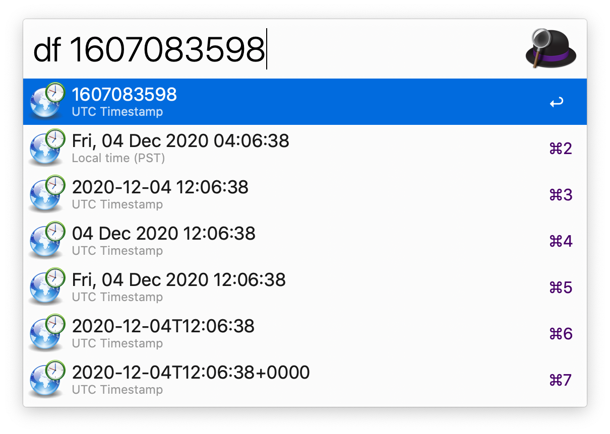
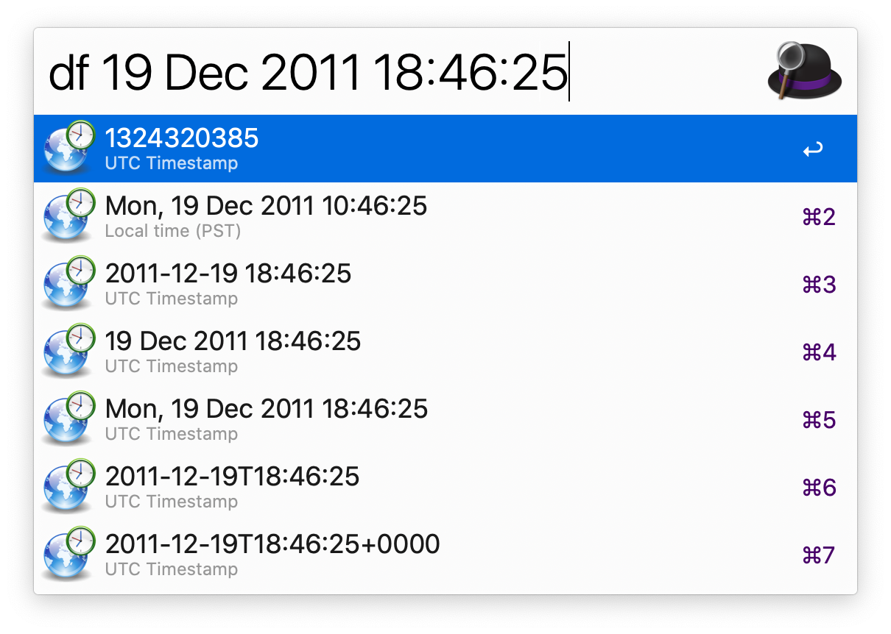

# alfred-datetime-format-converter

v0.3.0

Updated to work with Python3
For Python 2 use workflow v0.2.1

Alfred workflow for converting between timestamps and formatted datetime strings with ease.

Simply type "df" followed by: nothing or "now", a UTC unix timestamp, or a formatted datetime string.

This will present you with the parsed date in various formats ready to copy to your clipboard.

[Download](./download/DatetimeFormatConverter.alfredworkflow)

This is my modification of [Date Time Converter by mwaterfall](https://github.com/mwaterfall/alfred-datetime-format-converter), [fork by charlax](https://github.com/charlax/alfred-datetime-format-converter) and [Python3 update by alexmerkel](https://github.com/alexmerkel/alfred-datetime-format-converter)

[Alfred Forum Topic](http://www.alfredforum.com/topic/1558-datetime-format-converter-convert-between-unix-timestamps-and-datetime-strings/)

